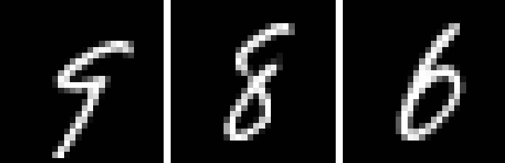
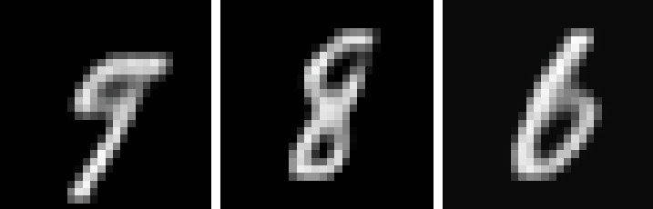
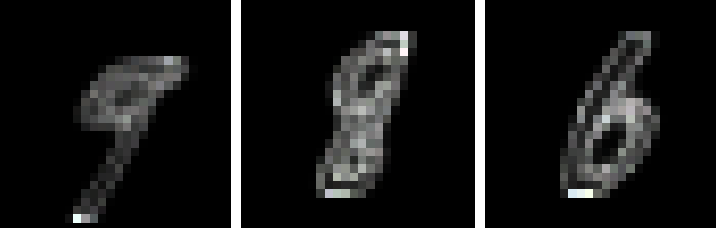

## Aleatoric Uncertainty
I tried to implement the loss of eq (8) from: A Kendall, Y Gal, “**What Uncertainties Do We Need in Bayesian Deep Learning for Computer Vision?**”, NIPS 2017 [arXiv](https://arxiv.org/abs/1703.04977)

#### WARNING
  - From the paper: 'In practice, we train the network to predict the log variance' (numerical stability)
  - I get `Nan` if `log_var` is unbounded (`relu` or `None` activations). Here I am using scaled `tanh` activation.
  - **EDIT** `None` activation in *both* mean and `log_var` branches seems to do the job

### Code

Train an autoencoder:

`
python main.py --mode train
`

Test it:

`
python main.py --mode test --checkpoint model/model
`

Visualize TensorBoard logs:

`
tensorboard --logdir logs/
`

###  Results

*Real Images*

*Generated images*

*Log Variance*

