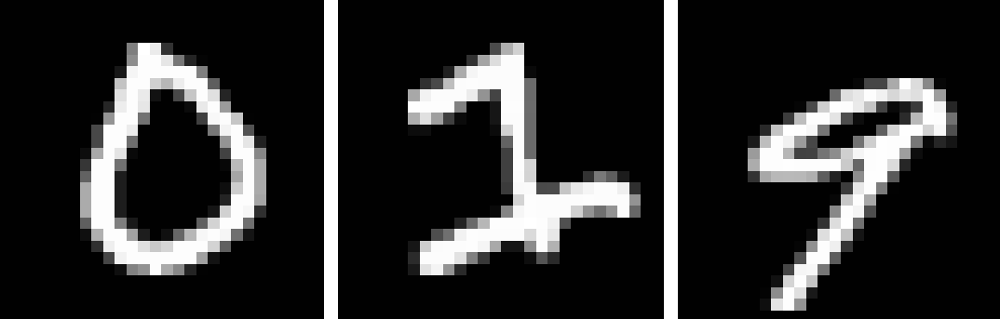
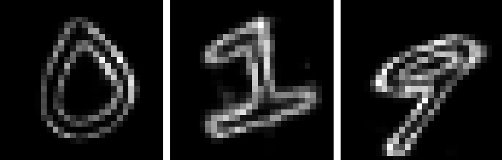

## Epistemic Uncertainty
Should be implemented with dropout at test time. I am sampling 10 nets here.

### Code

Download MNIST:

`
./download.sh
`

Rescale and save in a python dictionary (possibly resize):

`
python prepro.py
`

Train an autoencoder:

`
python main.py --mode train
`

Test it:

`
python main.py --mode test --checkpoint model/model
`

Visualize TensorBoard logs:

`
tensorboard --logdir logs/
`

###  Results

*Real Images*

*Generated images*

*Variance*

